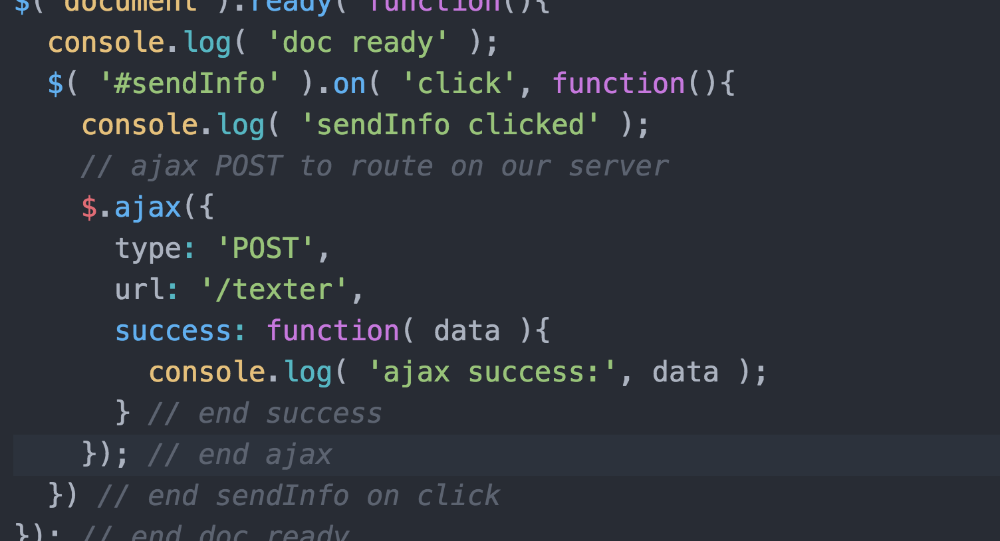

Pi Node Express Setup In Class
==============================

basic setup
-----------
* create project folder
* 'npm init' in this folder in terminal
* fill out project details (as much as you feel the need)
* you should now have 'package.json' in this folder

installing dependencies
-----------------------
* 'npm install express --save' in terminal
* you'll get some feedback in terminal, then will see a new "node_modules" folder
* also, 'package.json' will have 'express' and a version listed in a new dependencies portion

create your server
-------------------
* create 'server' folder
* create 'app.js' inside server folder
* require express and create an express app variable

* spin up a server on a port with the 'app.listen' command

* start server ('node server/app.js' in terminal)
* you should see "server is listening on port 3000" in your terminal

* remember: console.log on server side will show in terminal

create a route for the server
-----------------------------
* add a base route "app.get"

* restart server
* refresh "localhost:3000" in browser
* observe the awesome

set up to serve an html file
----------------------------
* require path module

* create 'public' folder in project root
* create 'index.html' in 'public' folder
* update 'app.get' to send this in response from a resolved path

setup public folder for common resources
----------------------------------------
* add 'app.use' to setup "public" folder as a static resource

* inside here add a 'scripts' folder
* within scripts add a js file ('example.js' is used here)
* source the js as you would normally in the html
* restart server and check that the sourcing is working

* also add a 'vendors' folder within which you can place JQuery
* source JQuery in your html file as usual

setting up a POST route that can be called from our site via AJAX
-----------------------------------------------------------------
* add a "app.post" route to app.js. This will receive some basic text so we'll call the route 'texter'. This wil both log something out server side and, for now, just send some text response

* add a button on html with an id of 'sendInfo'. We'll use this to trigger an AJAX call to the new post route
* add an on click JQuery for this button that will make an AJAX call to the url of our new post route. It'll also send a dummy object.

* note that the url is the same as the route in app.js
* restart server and refresh page
* click the button, yo
 
